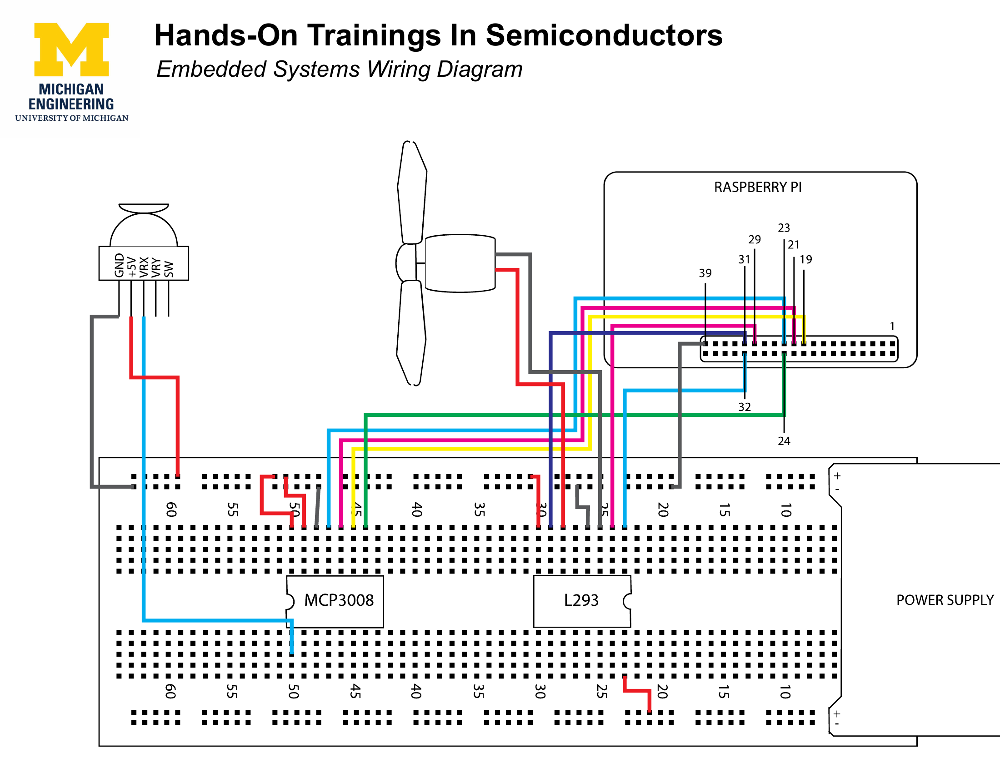

---
tags:
  - Lab 3
  - Digital I/O
  - motors
  - motor
  - L293
  - digitalWrite
  - pwmWrite
  - pinMode
  - wiring
search:
  boost: 2
---

# Lab 3 · Digital I/O & Motors — Controlling the Motor

This lab adds the L293 motor driver chip and the motor to your setup. You will write a program that sets the motor's direction and speed.

---

## Part 1 · Setting up the hardware

Today you have two chips to place instead of one: the MCP3008 (from Lab 2) and the L293 (new).

### The wiring diagram

<div class="wiring-diagram">

</div>

[Download the full PDF](../assets/images/wiring-diagram.pdf){ .md-button }

### Step 1 · Place the chips

Put both chips on the breadboard, each straddling the center gap. The **MCP3008 goes on the left** and the **L293 goes on the right** (check the labels printed lightly on the chips).

!!! warning "Both chips have orientation marks"
    Each chip has a small semi-circular divot. Make sure both face the direction shown in the wiring diagram before you press them in.

### Step 2 · Attach the power supply

The power supply board (from yesterday) connects to a battery this time. The motor needs more current than a USB cable alone can provide.

### Step 3 · Wire everything up

Follow the wiring diagram. Wire positions matter; wire colors do not.

---

## Part 2 · Programming the Motor

### Step 1 · Open the file

```
cd hotis-projects-starter
geany motor.c
```

### Step 2 · Configure pin modes (setup function)

Find the line in `setup()` that says `!!!! PUT YOUR SETUP CODE HERE !!!!`.

Before the motor can move, the Pi needs to know which pins are outputs and what kind:

- `L293_ENABLE` controls speed — it needs PWM output.
- `L293_INPUT1` and `L293_INPUT2` control direction — they need digital output.

Which function sets a pin's mode? What are the correct mode constants for each pin? → [pinMode()](../reference/pinmode.md) · [Pins & constants](../reference/pins-and-constants.md)

!!! question "Think about it"
    Why does `L293_ENABLE` need a different mode than the other two pins? What is the difference between `OUTPUT` and `PWM_OUTPUT`? → [What is PWM?](../concepts/what-is-pwm.md) · [The motor driver](../concepts/motor-driver.md)

### Step 3 · Drive the motor (loop function)

Find the `!!!! PUT YOUR LOOP CODE HERE !!!!` line in `loop()`. You need to:

1. **Set the motor speed** — use `pwmWrite()` on `L293_ENABLE`. `PWM_MAXVAL` is full speed. → [pwmWrite()](../reference/pwmwrite.md)
2. **Set the motor direction** — use `digitalWrite()` on `L293_INPUT1` and `L293_INPUT2`. The two direction pins must always be **opposite** values. → [digitalWrite()](../reference/digitalwrite.md) · [The motor driver](../concepts/motor-driver.md)
3. **Add a delay** — so the motor runs for a visible amount of time. → [delay()](../reference/delay.md)

!!! question "Try it"
    If the motor spins the wrong direction, what is the smallest change to your `digitalWrite()` calls that would reverse it?

### Step 4 · Build and run

```
make motor
sudo ./motor
```

The motor (with the fan blade) should spin. If it does not, check [Troubleshooting](../troubleshooting.md).

---

## Step 5 · Challenge

!!! question "Try it"
    Modify your program so the motor:
    
    1. Spins one direction for 5 seconds.
    2. Stops and spins the other direction for 5 seconds.
    3. Then slows to 60% speed and keeps spinning at that forever.
    
    Hints: you will need `delay()` for timing, and a fraction of `PWM_MAXVAL` for the final speed. Think about what 60% of `PWM_MAXVAL` looks like in code — and how `if/else` or multiple blocks can sequence the behavior. → [delay()](../reference/delay.md) · [pwmWrite()](../reference/pwmwrite.md)

---

## Bonus · Joystick controls the motor

What if the joystick controlled the motor's speed and direction, instead of hard-coded values?

The `joymotor.c` file in your repo is a completed example of exactly this. Study how it works — do not copy it line for line. Notice how it reads a value from the joystick and uses that to set the motor. How does it handle the fact that `analogRead()` returns 0–1023, but the motor direction expects only `HIGH` or `LOW`? → [Scaling numbers](../programming-basics/scaling-numbers.md)

---

## See also

- [pinMode()](../reference/pinmode.md)
- [digitalWrite()](../reference/digitalwrite.md)
- [pwmWrite()](../reference/pwmwrite.md)
- [delay()](../reference/delay.md)
- [The motor driver](../concepts/motor-driver.md)
- [Pins & constants](../reference/pins-and-constants.md)
